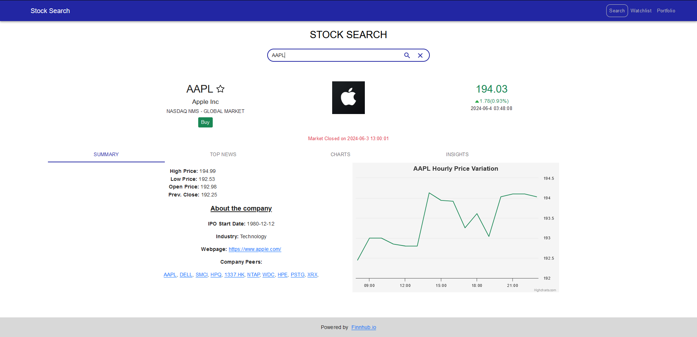
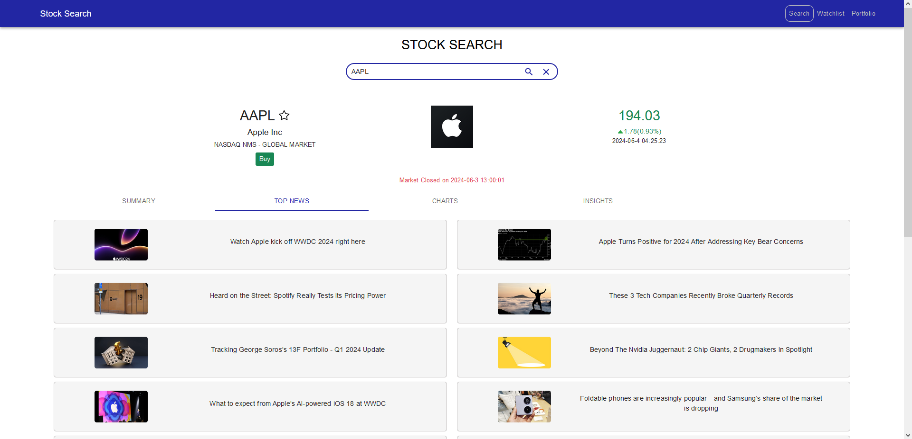
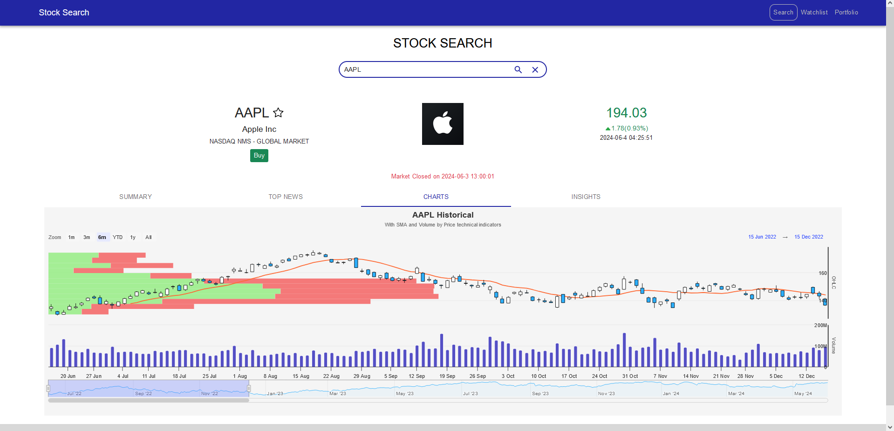
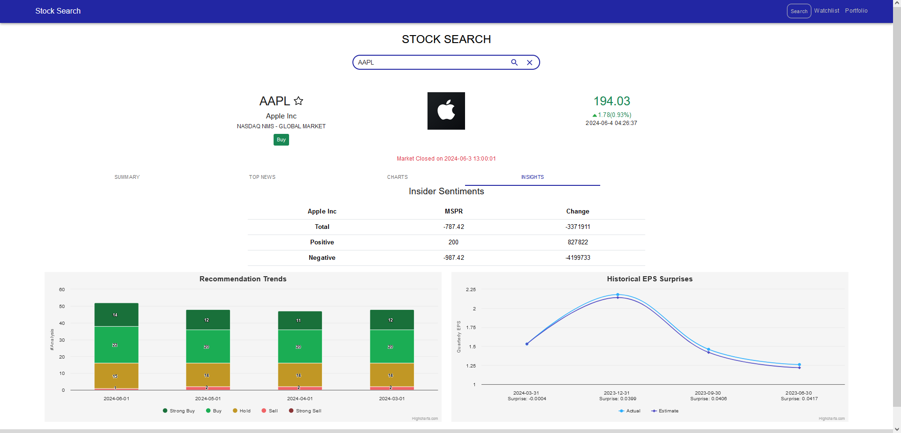

# [Stock Website](https://responsivetradingwebsite-862380211990.us-central1.run.app/)
Demo Link: https://responsivetradingwebsite-862380211990.us-central1.run.app/

* A fully responsive web app for searching and trading stocks in a sandboxed environment.
*  Users can trade based on market hours, favorite stocks, and view detailed graphs created using Highcharts.
* Features include:
    - Live market updates
    - Stock Search Autocomplete
    - Sandboxed trading
    - Historical charts (up to 2 years)
    - Historical EPS charts
    - News tab for each stock
* Deployed on Google Cloud Platform using Docker with CI/CD via GitHub Actions.
* Tech stack: MongoDB, Express, React, Node.js

*Stock Page*

*News Tab*

*Charts Tab*

*Insights Tab*
